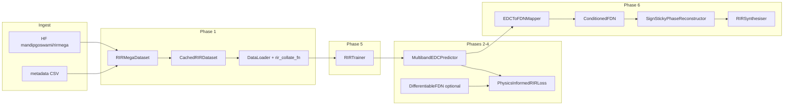

# Physics-Informed RIR Generation Framework — Architecture

## Entry points

- **Single entry point:** `RIR_Project.ipynb` — the only executable artifact. No standalone Python scripts; dependencies are installed in-cell via `!pip install ...` (no `requirements.txt` or `pyproject.toml` in repo).

## High-level structure

The notebook implements a **Physics-Informed RIR Generation Framework**: room parameters → neural models + differentiable FDN → Room Impulse Responses. Code is organized into **six sequential phases**:

| Phase | Name | Main components |
|-------|------|-----------------|
| 1 | Data pipeline | Helpers (`_parse_json_field`, `compute_edc`, `compute_multiband_edc`, `compute_room_modes`, `downsample_edc_tensor`), `RIRMegaDataset`, `CachedRIRDataset`, `rir_collate_fn`, `get_dataloader` |
| 2 | LSTM EDC predictor | `MultibandEDCPredictor` (LSTM + BatchNorm1d, outputs multiband EDC) |
| 3 | Physics-informed loss | `EDCReconstructionLoss`, `continuity_residual`, `momentum_residual`, `PhysicsInformedRIRLoss` |
| 4 | Differentiable FDN | `_hadamard_matrix`, `DifferentiableFDN` (fractional delays, log-space params) |
| 5 | Training loop | `TrainingConfig` (dataclass), `RIRTrainer` (dataloaders, models, criterion, AMP, `train_one_epoch`, `validate`, `fit`) |
| 6 | LSTM–FDN bridge & synthesis | `EDCToFDNMapper`, `ConditionedFDN`, `SignStickyPhaseReconstructor`, `RIRSynthesiser`, plus refinement/inference helpers |

## Data flow pipeline

- **Training path:** HuggingFace AudioFolder + metadata CSV → decode/pad/truncate RIR → Schroeder EDC (broadband + multiband) + room modes → `RIRMegaDataset` → optional `CachedRIRDataset` → `DataLoader` (`rir_collate_fn`) → `RIRTrainer` batches `(x_batch, y_batch)` → LSTM predicts `edc_pred` → `PhysicsInformedRIRLoss` (EDC + continuity + momentum; optional FDN EDC loss).
- **Inference/synthesis path:** Room params `X` → `MultibandEDCPredictor` → `edc_pred` → `EDCToFDNMapper` → FDN params (log_kappa, alpha, beta) → `ConditionedFDN` (late reverb) + early reflections → `SignStickyPhaseReconstructor` → full RIR from `RIRSynthesiser`.

## Data contracts (tensor schema)

- **Input X:** `[INPUT_DIM]` = 24: `[L, W, H, src_xyz(3), mic_xyz(3), a_broad, a_125..a_4k(6), mode_count_300, f_schroeder, f_1st_axial, mean_ax_spacing, std_ax_spacing, modal_overlap, tang_ax_ratio, log_vol]`.
- **Targets Y:** dict with `metrics` `[METRICS_DIM]` = 10, `rir` `[max_len]`, `edc` `[max_len]`, `edc_mb` `[num_time_steps, num_bands]`, `rir_length` scalar. Batch: same keys, batch dim first (e.g. `[B, 24]`, `[B, METRICS_DIM]`, `[B, max_len]`).
- **Constants:** `INPUT_DIM = 16 + MODAL_FEAT_DIM` (24), `MODAL_FEAT_DIM = 8`, `METRICS_DIM = 10`, `OCTAVE_BANDS` (6 bands), `DEFAULT_MAX_RIR_LEN = 32_000`, `DEVICE` from `torch.device("cuda" if ... else "cpu")`.

## Design patterns

- **Config object:** `TrainingConfig` dataclass holds all training/hyperparameters; passed into `RIRTrainer`.
- **Orchestrator/harness:** `RIRTrainer` builds dataloaders, models, criterion, optimiser, AMP; runs `train_one_epoch` / `validate` / `fit`.
- **Factory:** `get_dataloader(...)` returns a configured `DataLoader` (optionally wrapping with `CachedRIRDataset`).
- **Pipeline (procedural):** Phases 1→6 run in notebook order; later phases assume earlier cells have been run.
- **PyTorch conventions:** `Dataset` (`__getitem__` → single sample), custom `collate_fn` for batching, `nn.Module` for all models, device via `DEVICE` and `.to(device)`.
